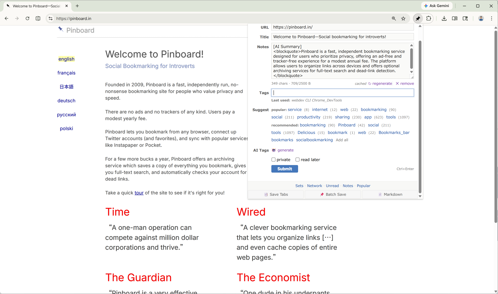

# Pinboard Bookmark Enhanced

[English](README.md) | [简体中文](README.zh-CN.md) | [繁體中文](README.zh-TW.md) | [繁體中文（香港）](README.zh-HK.md) | [Deutsch](README.de.md) | **Français** | [日本語](README.ja.md) | [Polski](README.pl.md) | [Русский](README.ru.md)

Une extension Chrome pour [Pinboard](https://pinboard.in) : étiquettes et résumés par IA, un mode lecture intégré avec traduction et surlignage, et 13 thèmes pour le site lui-même.

> **Remarque :** Nécessite un compte Pinboard.in — [Pinboard](https://pinboard.in) (pinboard.in) est un service de signets indépendant et **payant**. Cette extension est un client tiers qui se connecte à votre compte Pinboard existant à l'aide de votre propre jeton API Pinboard. Elle n'est ni affiliée à Pinboard, ni sponsorisée ou approuvée par Pinboard. Vous devez déjà posséder (ou souscrire à) un compte Pinboard.in payant pour utiliser cette extension.

---

## Fonctionnalités

### Enregistrer
- **Un clic, tout est rempli** : le titre, la description et le texte sélectionné sont repris, et les paramètres de suivi retirés de l'URL
- **Enregistrement par raccourci clavier** : sans ouvrir la fenêtre ; ou tous les onglets ouverts d'un coup
- **Fonctionne hors ligne** : les enregistrements passent par une file d'attente locale et sont renvoyés au retour de la connexion

### Étiquettes
- **Étiquettes et résumé par IA** : l'IA lit le corps de l'article, débarrassé des publicités, des menus et des barres latérales ; votre propre clé API, 14 fournisseurs ou tout point de terminaison compatible OpenAI
- **Autocomplétion** : à partir de vos étiquettes, des suggestions de Pinboard et de préréglages en un clic
- **Nettoyage des étiquettes** : repérez les doublons et les étiquettes peu utilisées, puis fusionnez-les par lots

### Lecture
- **Chaque page passe en mode lecture épuré** : vue Markdown avec table des matières, recherche et aperçu des notes de bas de page
- **Surlignage en cinq couleurs, avec notes** : les surlignages et les notes survivent aux nouveaux rendus, à la traduction et aux modifications de la page
- **Traduisez la page ou posez-lui vos questions** : traduction intégrale avec vue bilingue ; les réponses citent la source et y renvoient d'un clic
- **Cherchez et révisez les mots au fil de la lecture** : le dictionnaire affiche d'abord le sens qui correspond à votre phrase ; les mots enregistrés gardent vos notes et leur statut d'apprentissage, et peuvent être envoyés vers Anki ou Eudic. En option, des packs de dictionnaires hors connexion chinois-anglais et anglais-chinois
- **Une page entière pour les notes et le vocabulaire** : vos mots enregistrés et vos surlignages réunis au même endroit, avec recherche dans le dictionnaire et gestion par lots
- **Envoyer ou télécharger** : vers [Obsidian](https://obsidian.md), Notion, NotebookLM, un Gist GitHub ou n'importe quel webhook ; ou en `.md`, `.html`, `.epub` pour votre liseuse

### Personnalisation
- **13 thèmes pour pinboard.in** (Dracula · Nord · Catppuccin · Solarized · …) plus votre CSS personnalisé
- **Archivage automatique dans la [Wayback Machine](https://web.archive.org)** : à chaque enregistrement si vous le souhaitez ; les pages restent accessibles même quand le lien d'origine disparaît
- **Sauvegarde et synchronisation** : les paramètres via Chrome Sync, le vocabulaire via votre propre Google Drive, et des sauvegardes JSON manuelles pouvant inclure les surlignages, les notes, le vocabulaire et vos clés API. Chaque option est facultative ; les conditions exactes figurent dans la section Confidentialité ci-dessous
- **9 langues** · raccourcis configurables · stockage local en priorité · aucun pistage

## Installation

**[→ Installer depuis le Chrome Web Store](https://chromewebstore.google.com/detail/pinboard-bookmark-enhance/pnjndmjhljjbdlbejeenkepdalokfooh)** (recommandé)

Ou chargez une version décompressée depuis un ZIP de release :
1. Téléchargez le dernier [ZIP de release](https://github.com/pine2D/Pinboard-Bookmark-Enhanced/releases/latest)
2. Décompressez
3. `chrome://extensions/` → activez le **Mode développeur** → **Charger l'extension non empaquetée** → sélectionnez le dossier décompressé

Le répertoire source utilise un identifiant de développement distinct et fixe. Il peut donc coexister avec la version du Chrome Web Store pour les tests. Le ZIP de release utilise l'identifiant du Chrome Web Store et ne peut pas coexister avec la version du Store dans un même profil Chrome. Chrome Sync peut partager les paramètres dès que leur synchronisation est activée sur chaque appareil. Avant de remplacer une ancienne release chargée manuellement, exportez ses paramètres, puis importez la sauvegarde après avoir chargé la nouvelle release.

Après l'installation : cliquez sur l'icône de la barre d'outils → collez votre [jeton API Pinboard](https://pinboard.in/settings/password) → enregistrez

## Confidentialité

Aucun tracking, aucune analytique, aucune télémétrie. Pour les nouveaux utilisateurs, les paramètres et identifiants restent par défaut sur cet appareil. La synchronisation des paramètres ordinaires s'active séparément sur chaque appareil. La synchronisation des identifiants est un choix unique à l'échelle du compte Chrome, mais seuls les appareils où la synchronisation des paramètres est activée y participent ; les autres continuent d'utiliser leurs identifiants locaux. Elle est désactivée par défaut pour les nouveaux utilisateurs. Si une mise à niveau trouve déjà des identifiants non vides dans Chrome Sync, elle reste activée afin d'éviter toute perte de données. Lorsqu'elle est activée, les clés API, jetons, mots de passe et identifiants d'exportation sont partagés via Chrome Sync ; ils sont obfusqués, pas chiffrés. Les signets enregistrés, le contenu des pages et la file d'attente hors ligne n'entrent jamais dans Chrome Sync. Les requêtes IA sont envoyées **uniquement** par les fonctionnalités que vous activez ou utilisez — tags/résumé IA, questions-réponses sur la page, traduction, explication de sélection, ou le survol des points clés facultatif — et vont directement au fournisseur que vous avez configuré. À l'installation, seul l'accès à Pinboard est accordé ; l'IA, Jina, les sites sélectionnés pour le traitement par lot et les destinations facultatives d'exportation et d'archivage ne demandent que l'autorisation du site précis au moment où vous lancez l'action correspondante. Les points de terminaison réseau personnalisés doivent utiliser HTTPS ; HTTP n'est autorisé que pour `localhost`, `127.0.0.1` et `[::1]`. Les pages de l'extension appliquent une Content-Security-Policy stricte (aucun code distant). Politique complète : <https://pine2d.github.io/Pinboard-Bookmark-Enhanced/privacy.html>

## Licence

MIT. Voir [LICENSE](LICENSE).
